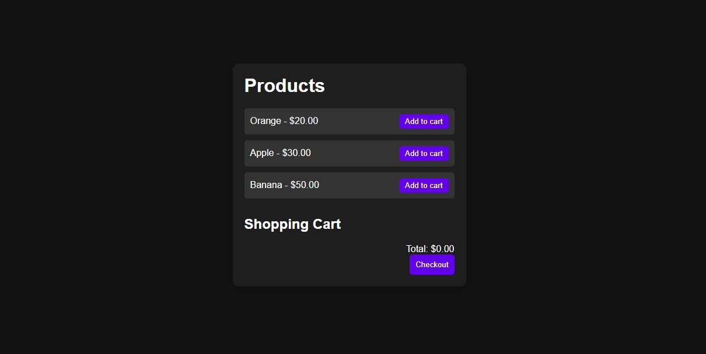

💼 Shopping-Cart-Logic-JS

A simple and functional shopping cart demo built using Vanilla JavaScript, showcasing the core logic behind adding items to a cart, saving it in localStorage, and rendering a dynamic cart UI — all without any frameworks or backend!

## 📸 Demo Preview

 <!-- Optional: Add a screenshot of your app -->

---

## 🚀 Features

- 🛍️ Add products to cart
- 💾 Persistent cart using `localStorage`
- 💵 Real-time total price updates
- 🧹 Clear cart on checkout
- 🎨 Basic responsive UI with dynamic rendering

---

## 🛠️ Tech Stack

| Tool | Description |
|------|-------------|
|  | Markup for the product and cart layout |
|  | Basic styling and layout |
|  | Core logic for cart functionality |
|  | Saves cart data in the browser |

-

📂 Folder Structure

📆 Shopping-Cart-Logic-JS
├── index.html
├── style.css
├── script.js
└── README.md

📦 How to Run

Clone this repo:

git clone https://github.com/your-username/Shopping-Cart-Logic-JS.git

Open index.html in your browser.

Start adding products to your cart!

🧠 Educational Purpose

This project demonstrates the core logic of how shopping carts work in an e-commerce front end using pure JavaScript. Great for beginners learning:

DOM manipulation

Event handling

State management in the browser

LocalStorage API

📌 To-Do Ideas (Optional Enhancements)

📜 License

This project is licensed under the MIT License.

## Author
Developed with ❤️ by KISHAN SHARMA
linkedin : https://www.linkedin.com/in/kishanshr/

🙌 Acknowledgements

Built with ❤️ for learning and demonstration purposes.
